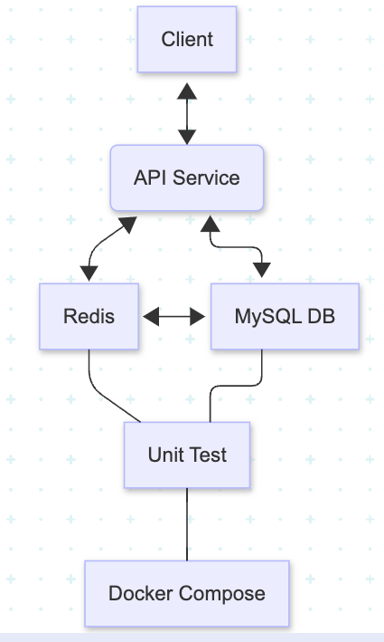
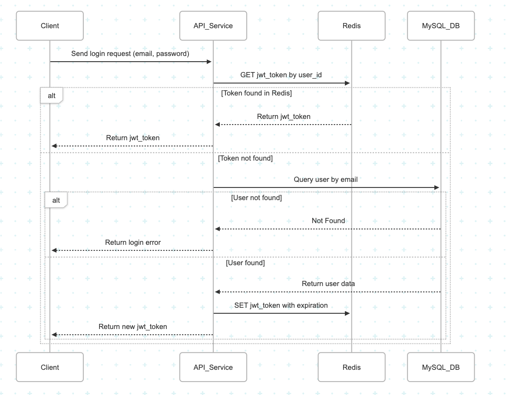
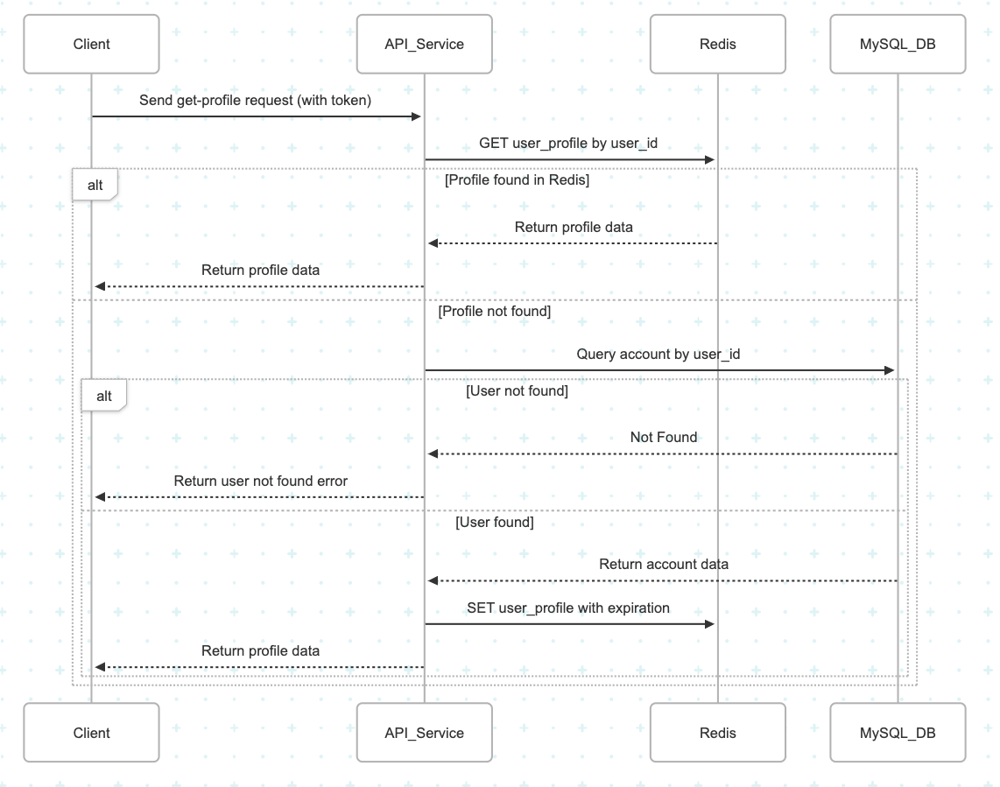

# HR-System

> 員工系統管理服務 (Employee Management & Leave Request System)

---

## 📄 簡介 (Project Description)

HR-System 是一個執行員工管理與請假流程的背後服務，最基本功能包括：
- 員工資訊管理（職種、聯絡資訊、薪資等）
- HR 新增員工資料
- 請假申請，以及 HR 審核請假單

目前使用 Makefile 搭配 docker-compose 一鍵啟動。


## ⚙️ Tech Stack

- Golang 1.23+
- Gin Web Framework
- MySQL 8.0
- Redis 7
- GORM ORM & GORM Migration
- Gomock + Testify 單元測試
- Docker / docker-compose 快速啟動
- Makefile 一鍵搭建


## 🚀 啟動流程 (Setup & Run)

1. 確保環境安裝
    - Docker
    - Docker Compose
    - Make (GNU make)

2. 啟動服務：
```bash
make up
```

3. table migration
```bash
make migrate
```

4. 輸入第一批測試資料 (SEED data)
```bash
make seed
```

5. (選擇)如果要重置環境
```bash
make clean
make up
make migrate
make seed
```


## 📊 Makefile 主要指令
| 指令 | 說明 |
|:----|:-----|
| make up | 啟動 docker-compose，並且在啟動之前自動執行單元測試。若單元測試失敗，則不會啟動 app server |
| make down | 停止 docker-compose 服務 |
| make clean | 停止 docker-compose，並清除所有資料卷 (volume) |
| make restart | 重新啟動 (down ➔ up) |
| make migrate | 在容器內執行 GORM Migration，自動建表 |
| make seed | 在容器內執行資料初始化 (SEED data) |
| make rebuild-app | 重新 build app container 並且只啟動 app |
| make test | 執行本地端所有單元測試 |
| make tidy | 清理 go.mod 和 go.sum |
| make local-run | 本機直接啟動 Golang server |
| make local-migrate | 本機直接執行 migration |
| make local-seed | 本機直接執行資料 SEED |


## 📚 環境變數 (.env)

請檢查根目錄的 `.env.example`，複製一份成 `.env`，修改相容給自己的環境設定：

重要環境變數：
- `DB_HOST`
- `DB_USER`
- `DB_PASSWORD`
- `DB_NAME`
- `REDIS_HOST`


## 📒 API 文件 (Swagger UI)

開啟服務後，可以使用postman匯入 collection 查看API 文件：

```
hr-system.postman_collection.json
```


## 🛋️ Project Structure

```
HR-SYSTEM/
├── cmd/
│   └── server/
│       └── main.go
├── internal/
│   ├── api/
│   │   └── handlers/
│   ├── config/
│   ├── infra/
│   │   ├── cache/
│   │   └── database/
│   ├── interfaces/
│   │   └── mocks/
│   ├── models/
│   ├── seeds/
│   ├── services/
│   └── utils/
├── Dockerfile
├── docker-compose.yml
├── Makefile
└── go.mod / go.sum
```


## 🏆 Features

- 員工管理 API (新增、查詢)
- 請假管理 API (申請、HR審核)
- GORM Migration 自動建表
- 資料 SEED 輸入
- 單元測試 (mock repository)
- 使用 Docker 搭配 MySQL + Redis + API server

# System structure



# API sequence diagram

## login-api



## get-profile-api


